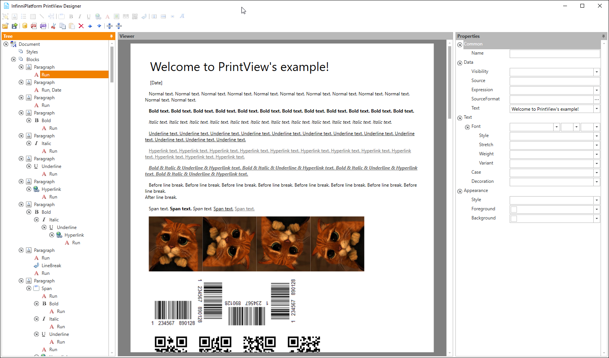

Print View Designer
===================

Print View Designer is the special WYSIWYG editor for creating Print View templates. Currently it works only on Windows 7+ with pre-installed .NET 4.5.

Print View Designer is an open-source project and available here:

    https://github.com/InfinniPlatform/InfinniPlatform.PrintViewDesigner

**1.** Download a Windows installation script InfinniPlatform.PrintViewDesigner here_.

**2.** Run Install.bat:

.. code-block:: bash

    Install.bat

**3.** Go to the designer folder (where ``X`` - version number of the designer):

.. code-block:: bash

    cd InfinniPlatform.PrintViewDesigner.X

**4.** Run the designer:

.. code-block:: bash

    InfinniPlatform.PrintViewDesigner.exe

Below is an example of the designer main window.

.. _`here`: https://raw.githubusercontent.com/InfinniPlatform/InfinniPlatform.PrintViewDesigner/master/InfinniPlatform.PrintViewDesigner/Install.bat
